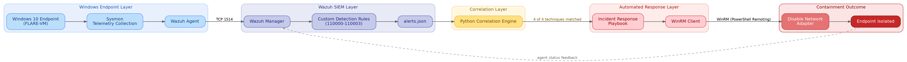
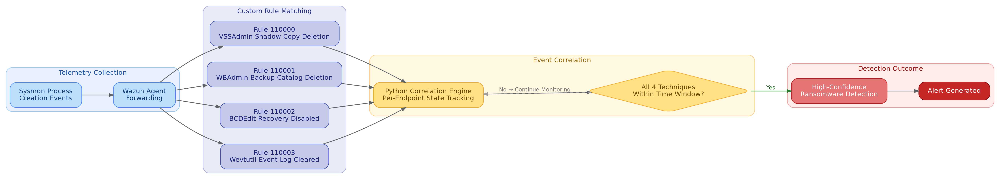
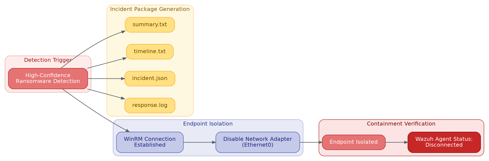
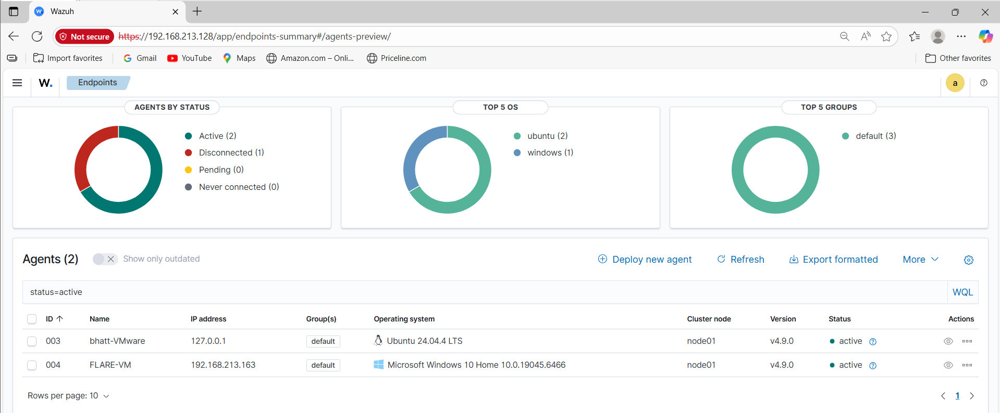
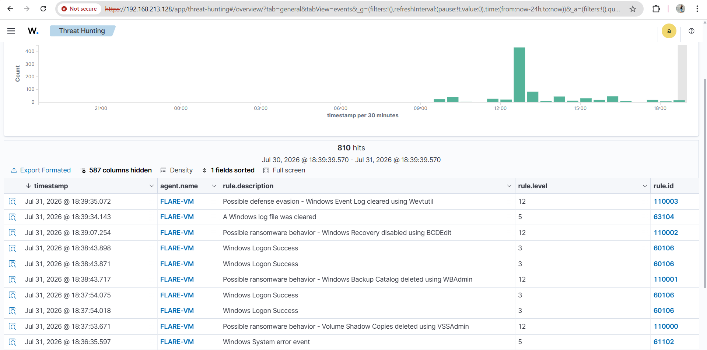
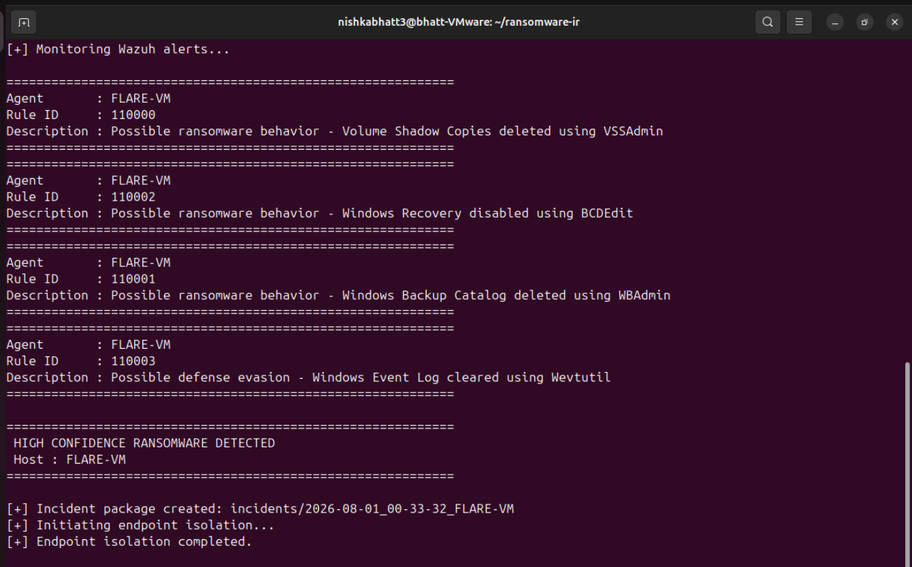
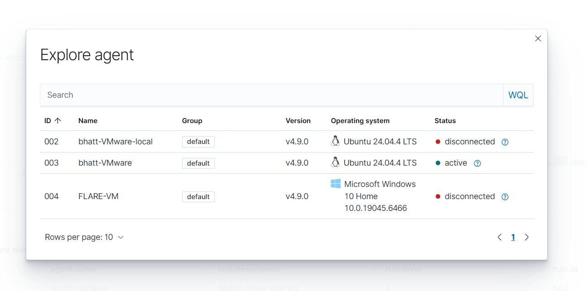
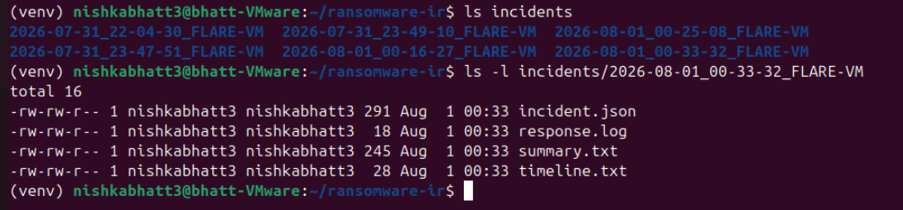

# Wazuh Ransomware Incident Response Framework

> An automated ransomware detection and incident response framework that combines **Wazuh SIEM**, **Sysmon**, **Python-based event correlation** and **WinRM** to detect ransomware behavior and automatically isolate compromised Windows endpoints.

---
## Overview

Ransomware attacks often execute a sequence of destructive actions before encrypting files, such as deleting shadow copies, disabling recovery mechanisms, removing backup catalogs and clearing Windows event logs. While these behaviors may individually appear legitimate, observing them together on the same endpoint is a strong indicator of ransomware activity.

This project implements a behavior based ransomware detection and automated incident response framework using Wazuh SIEM, Sysmon, Python and WinRM.

Instead of relying on a single security alert, the framework correlates four ransomware preparation behaviors detected on the same endpoint within a configurable time window. Once all required behaviors are observed, a custom Python correlation engine generates a high-confidence detection, automatically creates an incident package and isolates the affected endpoint by disabling its network adapter through WinRM.

The project demonstrates an end-to-end detection engineering workflow from telemetry collection and custom rule development to automated containment and incident documentation.

---

## Key Features

- Custom Wazuh rules for ransomware preparation behaviors
- Sysmon based endpoint telemetry collection
- Python correlation engine for multi-event detection
- Configurable correlation time window
- Per endpoint state tracking
- Automated incident package generation
- WinRM based endpoint isolation
- MITRE ATT&CK technique mapping
- Structured logging and response tracking

---
# Architecture

The framework follows a layered architecture that combines endpoint telemetry, SIEM-based detection, Python-driven event correlation and automated incident response.

The following components work together to collect endpoint telemetry, detect ransomware preparation behaviors, correlate related events and automatically contain the affected endpoint.

### Components
| Component | Purpose |
|-----------|---------|
| **Windows 10 (FLARE-VM)** | Simulates the protected endpoint and ransomware activity. |
| **Sysmon** | Collects detailed Windows telemetry, including process creation events. |
| **Wazuh Agent** | Forwards endpoint telemetry to the Wazuh Manager. |
| **Wazuh Manager** | Processes incoming events and evaluates custom detection rules. |
| **Custom Detection Rules** | Detect ransomware preparation behaviors based on Sysmon telemetry. |
| **Python Correlation Engine** | Monitors Wazuh alerts, correlates multiple behaviors within a configurable time window and confirms high-confidence ransomware activity. |
| **Incident Response Playbook** | Generates incident artifacts and initiates automated response actions. |
| **WinRM** | Executes remote PowerShell commands to isolate the compromised endpoint. |

The separation between detection, correlation, and response improves maintainability while allowing the correlation logic to remain independent of Wazuh's native XML rule engine.

---
# Detection Workflow

The detection workflow combines Sysmon telemetry, custom Wazuh detection rules and a Python-based correlation engine to identify ransomware preparation behaviors with high confidence.

## Detection Process

1. **Telemetry Collection**
   - Sysmon monitors endpoint activity and records Windows process creation events.
   - The Wazuh Agent forwards these events to the Wazuh Manager for analysis.

2. **Custom Rule Matching**
   - The Wazuh Manager evaluates incoming events against four custom detection rules designed to identify common ransomware preparation techniques.

| Rule ID | Behavior |
|---------:|----------|
| **110000** | Volume Shadow Copy deletion using `vssadmin.exe` |
| **110001** | Windows Backup Catalog deletion using `wbadmin.exe` |
| **110002** | Windows Recovery Environment disabled using `bcdedit.exe` |
| **110003** | Windows Event Log clearing using `wevtutil.exe` |

3. **Event Correlation**
   - A Python-based correlation engine continuously monitors `alerts.json`.
   - Detection events are tracked independently for each endpoint.
   - A high-confidence ransomware detection is generated only when all four behaviors are observed within the configured correlation window.

This multi-event correlation approach reduces false positives by requiring multiple independent ransomware preparation behaviors before triggering an automated response.

---
# Incident Response Workflow

Once the Python-based correlation engine confirms high-confidence ransomware activity, the framework automatically initiates an incident response playbook.

## Response Process

1. **High-Confidence Detection**
   - The correlation engine confirms that all four ransomware preparation behaviors have been observed within the configured correlation window.

2. **Incident Package Generation**
   - A dedicated incident directory is created for the affected endpoint.
   - The playbook generates the following artifacts:

| File | Description |
|------|-------------|
| `summary.txt` | High-level incident summary including affected host and severity. |
| `timeline.txt` | Chronological record of the detected ransomware behaviors. |
| `incident.json` | Structured incident data for automated processing. |
| `response.log` | Log of automated response actions performed by the playbook. |

3. **Endpoint Isolation**
   - The playbook establishes a WinRM session with the affected Windows endpoint.
   - A PowerShell command disables the network adapter, preventing further communication with the network.

4. **Containment Verification**
   - Once isolated, the Wazuh Agent transitions to the **Disconnected** state, confirming successful containment.

This automated workflow minimizes response time while preserving incident evidence for further investigation.

---
# Demonstration

The following screenshots illustrate the framework operating in a controlled lab environment and demonstrate the complete detection and automated response workflow.

## 1. Wazuh Dashboard

The Wazuh Dashboard displays the monitored endpoints and provides centralized visibility into the security environment.

---
## 2. Custom Rule Detection

Custom Wazuh rules detect four ransomware preparation behaviors generated on the Windows endpoint.

---
## 3. Automated Detection and Response

The Python correlation engine monitors Wazuh alerts in real time. Once all four ransomware behaviors are detected within the configured correlation window, the playbook automatically creates an incident package and initiates endpoint isolation.

---
## 4. Endpoint Isolation

Following successful containment, the Windows endpoint is isolated from the network and the Wazuh agent transitions to the **Disconnected** state.

---
## 5. Incident Package

The automated playbook generates structured incident artifacts for investigation and reporting.

---
# Future Improvements

Although the framework successfully demonstrates end-to-end ransomware detection and automated incident response, several areas can be explored to further enhance its capabilities.

- **Native Wazuh Rule Correlation**
  During development, native Wazuh XML correlation was evaluated to correlate the four ransomware preparation behaviors into a single high-confidence detection. However, the required correlation logic could not be implemented due to limitations in expressing the desired multi-rule Boolean correlation. As a result, a custom Python-based correlation engine was developed. Future work will investigate advanced Wazuh correlation techniques or newer platform capabilities that may allow this logic to be implemented directly within Wazuh.

- **Continuous Correlation Service**
  The current implementation requires `correlator.py` to be started manually before monitoring begins. A future enhancement is to deploy the correlation engine as a background service (for example, a `systemd` service or Docker container) so that monitoring starts automatically with the host and remains continuously available.

- **Support for Additional Ransomware Behaviors**
  The current framework focuses on four common ransomware preparation techniques. Future versions could extend detection coverage by correlating additional behaviors such as mass file modifications, suspicious encryption activity, privilege escalation, service termination and defense evasion techniques.

- **Automated Alerting and Case Management**
  The framework currently generates local incident artifacts after successful detection. Future enhancements could integrate with external notification and case management platforms such as email, Slack, Microsoft Teams, or ticketing systems to improve incident handling and analyst workflows.

- **Scalability and Performance Evaluation**  
  The project has been validated in a controlled virtual environment. Future work could evaluate the correlation engine across multiple endpoints, larger event volumes and enterprise-scale deployments to assess performance and scalability.

## Additional Documentation

Detailed environment setup and execution instructions are available in:
- [`docs/setup.md`](docs/setup.md)

---
# Conclusion

This project demonstrates an end-to-end ransomware detection and automated incident response framework using Wazuh, Sysmon, Python and WinRM. By combining behavior-based detection, multi-event correlation and automated endpoint isolation the framework showcases a practical approach to improving ransomware detection while providing a foundation for future enhancements.
